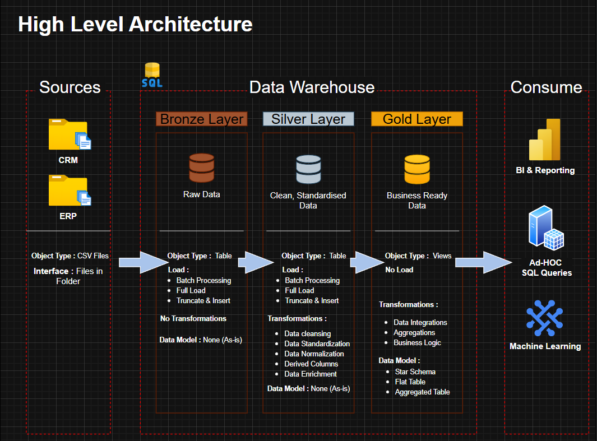
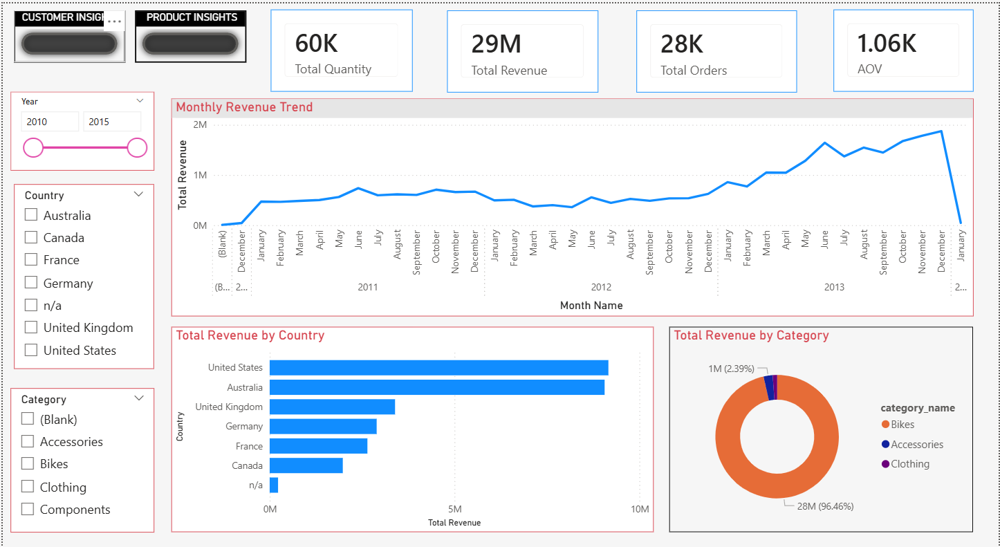

# Data Warehouse and Analytics Project

Welcome to the **Data Warehouse and Analytics Project** repository! 🚀  
This project demonstrates a complete end-to-end data solution — from designing a modern SQL data warehouse using Medallion Architecture to delivering actionable business insights through an interactive Power BI dashboard.

Designed as a portfolio-grade project, it showcases best practices in:
- Data Engineering
- ETL Pipelines
- Dimensional Modeling
- SQL Analytics
- Power BI Visualization
- Business Intelligence

---
## 🏗️ Data Architecture

The data architecture for this project follows Medallion Architecture **Bronze**, **Silver**, and **Gold** layers:


1. **Bronze Layer**: Stores raw data as-is from the source systems. Data is ingested from CSV Files into SQL Server Database.
2. **Silver Layer**: This layer includes data cleansing, standardization, and normalization processes to prepare data for analysis.
3. **Gold Layer**: Houses business-ready data modeled into a star schema required for reporting and analytics.

---
## 📖 Project Overview

This project involves:

1. **Data Architecture**: Designing a Modern Data Warehouse Using Medallion Architecture **Bronze**, **Silver**, and **Gold** layers.
2. **ETL Pipelines**: Extracting, transforming, and loading data from source systems into the warehouse.
3. **Data Modeling**: Developing fact and dimension tables optimized for analytical queries.
4. **Analytics & Reporting**: Creating SQL-based reports and dashboards for actionable insights.
5. **Power BI Dashboarding**: Transforming Gold Layer data into interactive executive, customer, and product dashboards.

🎯 This repository is an excellent resource for professionals and students looking to showcase expertise in:
- SQL Development
- Data Architect
- Data Engineering  
- ETL Pipeline Developer  
- Data Modeling  
- Data Analytics  
- Power BI Dashboard Development
- DAX
- Business Intelligence
- Data Visualization

---

## 🛠️ Important Links & Tools:

Everything is for Free!
- **[Datasets](datasets/):** Access to the project dataset (csv files).
- **[SQL Server Express](https://www.microsoft.com/en-us/sql-server/sql-server-downloads):** Lightweight server for hosting your SQL database.
- **[SQL Server Management Studio (SSMS)](https://learn.microsoft.com/en-us/sql/ssms/download-sql-server-management-studio-ssms?view=sql-server-ver16):** GUI for managing and interacting with databases.
- **[Git Repository](https://github.com/):** Set up a GitHub account and repository to manage, version, and collaborate on your code efficiently.
- **[Microsoft PowerBI Desktop](https://www.microsoft.com/en-us/power-platform/products/power-bi/desktop):** Design interactive dashboards for analysis and insights
- **[DrawIO](https://www.drawio.com/):** Design data architecture, models, flows, and diagrams.
- **[Notion](https://www.notion.com/templates/sql-data-warehouse-project):** Get the Project Template from Notion
- **[Notion Project Steps](https://www.notion.so/DATA-WAREHOUSE-PROJECT-3531d56a8c1e805287b0fbe99ab88e66?source=copy_link):** Access to All Project Phases and Tasks.

---

## 🚀 Project Requirements

### Building the Data Warehouse (Data Engineering)

#### Objective
Develop a modern data warehouse using SQL Server to consolidate sales data, enabling analytical reporting and informed decision-making.

#### Specifications
- **Data Sources**: Import data from two source systems (ERP and CRM) provided as CSV files.
- **Data Quality**: Cleanse and resolve data quality issues prior to analysis.
- **Integration**: Combine both sources into a single, user-friendly data model designed for analytical queries.
- **Scope**: Focus on the latest dataset only; historization of data is not required.
- **Documentation**: Provide clear documentation of the data model to support both business stakeholders and analytics teams.

---

### BI: Analytics & Reporting (Data Analysis)

#### Objective
Develop SQL-based analytics to deliver detailed insights into:
- **Customer Behavior**
- **Product Performance**
- **Sales Trends**

These insights empower stakeholders with key business metrics, enabling strategic decision-making.

---

## 📊 Power BI Dashboard

This project includes an interactive Power BI dashboard built on the Gold Layer star schema to transform warehouse data into business-ready insights.

### Dashboard Pages:

### 1. Executive Dashboard
### 2. Customer Insights
### 3. Product Performance

### Dashboard Screenshot:


## 📂 Repository Structure
```
data-warehouse-project/
│
├── datasets/                           # Raw datasets used for the project (ERP and CRM data)
│
├── docs/                               # Project documentation and architecture details
│   ├── data_architecture.png           # Snapshot of Draw.io file showing the project's architecture
│   ├── data_catalog.md                 # Catalog of datasets, including field descriptions and metadata
│   ├── data_flow.png                   # Snapshot of Draw.io file for the data flow diagram
│   ├── data_models.drawio              # Snapshot of Draw.io file for data models (star schema)
│   ├── naming-conventions.md           # Consistent naming guidelines for tables, columns, and files
│
├── scripts/                            # SQL scripts for ETL and transformations
│   ├── bronze/                         # Scripts for extracting and loading raw data
│   ├── silver/                         # Scripts for cleaning and transforming data
│   ├── gold/                           # Scripts for creating analytical models
│
├── tests/                              # Test scripts and quality files
│
├── dashboard/                          # Power BI Dashboard for sales, customer & product analysis
    ├──sales_dashboard.pbix             # PowerBI(.pbix) file for dashboard
    ├──dashboard_screenshots/           # Snapshots of the dashboard pages
    ├──README.md                        # Dashboard overview
│
├── README.md                           # Project overview and instructions
├── LICENSE                             # License information for the repository
├── .gitignore                          # Files and directories to be ignored by Git
```
---
## 💡 Key Business Insights Generated

- Identified top-performing customers by lifetime revenue
- Segmented customers into value tiers for retention strategy
- Evaluated product category performance and contribution
- Tracked revenue patterns across multiple years
- Compared product volume vs profitability for strategic planning
---
---
## 🛡️ License

This project is licensed under the [MIT License](LICENSE). You are free to use, modify, and share this project with proper attribution.

## 🌟 About Me

Hi there! I'm **Akarsh Kapoor**. I'm a curious data enthusiast who loves exploring SQL, analytics, and real-world problem solving. I enjoy turning raw data into useful insights while building projects that make learning data both practical and fun!

Let's stay in touch! Feel free to connect with me :

[](https://www.linkedin.com/in/akarsh-kapoor/)
