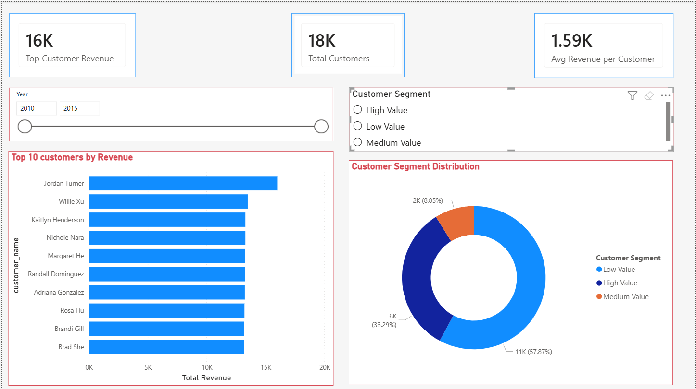
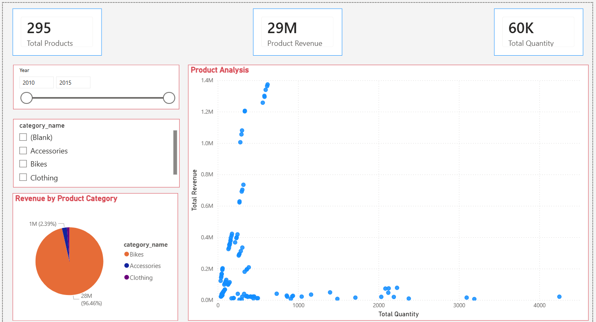

# Power BI Dashboard — SQL Data Warehouse Analytics

## Project Overview
This project extends the SQL Data Warehouse by transforming Gold Layer business data into an interactive Power BI analytics solution.

It demonstrates end-to-end capabilities across:
- SQL Data Warehousing
- ETL Architecture (Bronze / Silver / Gold)
- Star Schema Modeling
- DAX Measures
- Business Intelligence & Visualization

---

# Dashboard Pages

## 1. Executive Dashboard
### Key Features:
- Total Revenue
- Total Orders
- Total Quantity
- Average Order Value (AOV)
- Monthly Revenue Trend
- Revenue by Country
- Revenue by Product Category

---

## 2. Customer Insights
### Key Features:
- Total Customers
- Top 10 Customers by Revenue
- Customer Segmentation (High / Medium / Low Value)

---

## 3. Product Performance
### Key Features:
- Product Category Revenue
- Top Products by Revenue
- Revenue vs Quantity Scatter Analysis

---

# Data Model
The dashboard is built on a dimensional model using:
- gold.fact_sales
- gold.dim_customers
- gold.dim_products
- dim_dates

---

# Core DAX Measures
- Total Revenue
- Total Orders
- Total Quantity
- AOV
- Revenue LY

---

# Business Insights Generated
- Identified top-performing customers
- Segmented customer base by revenue contribution
- Evaluated product category performance
- Tracked revenue trends across years
- Compared product revenue vs volume dynamics

---

# Tools Used
- SQL Server / SQL Express
- Power BI
- DAX
- GitHub

---
